 

## サービス URL

https://caloreach.ari-life.com/

下記メールアドレスとパスワードでログインをして、ゲストアカウントで操作をお試しいただけます。 
メールアドレス：`test-user@yourdomain.com` 
パスワード：`guest1234`

## 概要

- 1 日の目標摂取カロリー達成にフォーカスした記録アプリ
- 入力の手間を減らす、レギュラーフード機能
- Next.js × Supabase で認証・CRUD・履歴管理を実装

## サービス概要

カロリーチは、1 日の目標摂取カロリーに対する進捗を 
一目で把握できるシンプルな Web アプリです。

正確な栄養管理が目的ではなく、「記録を続けられること」を大切にし、 
入力回数と操作量を最小限に設計しています。 

## このサービスが生まれた理由

体重増加を目指していた友人が、カロリー記録を 1 か月でやめてしまった経験から、なるべく手間をかけずに記録するアプリを作りたいと思い制作しました。メモ帳のように使えることをイメージしています。

## 機能一覧

### メイン画面

- 目標カロリーに対する進捗を即時表示
- 当日の食事履歴を一覧管理

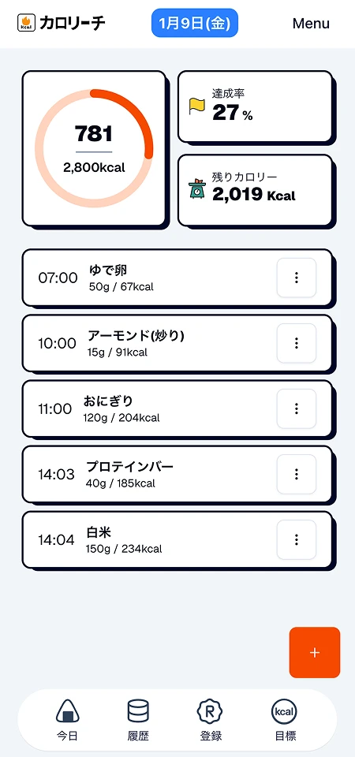

---

### 食事記録

- レギュラーフードからワンタップ登録
- 食品検索＋グラム入力によるカロリー自動計算
- 手入力による柔軟な記録

<table>
  <tr>
    <td align="center"> 
      記録方法選択</td>
    <td align="center">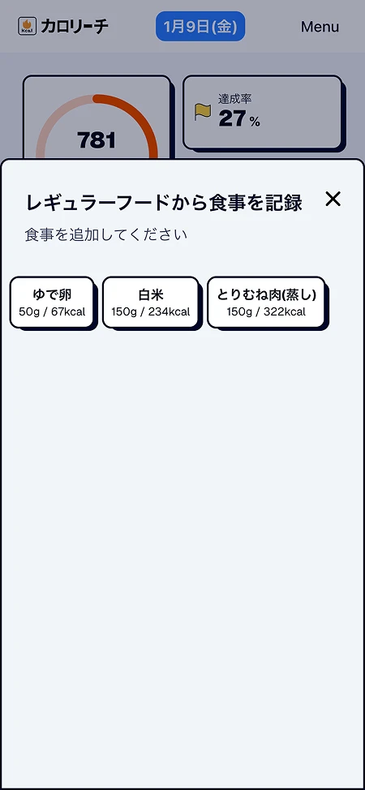 
      内容入力</td>
    <td align="center">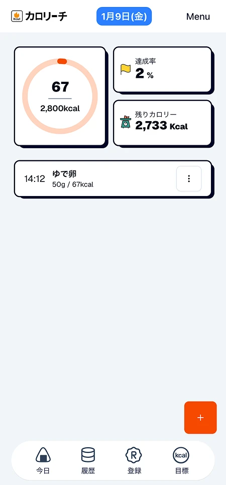 
      記録完了</td>
  </tr>
</table>

---

### レギュラーフード管理

よく食べる食事を事前に登録し、食事記録時の入力負荷を軽減します。

<table>
  <tr>
    <td align="center">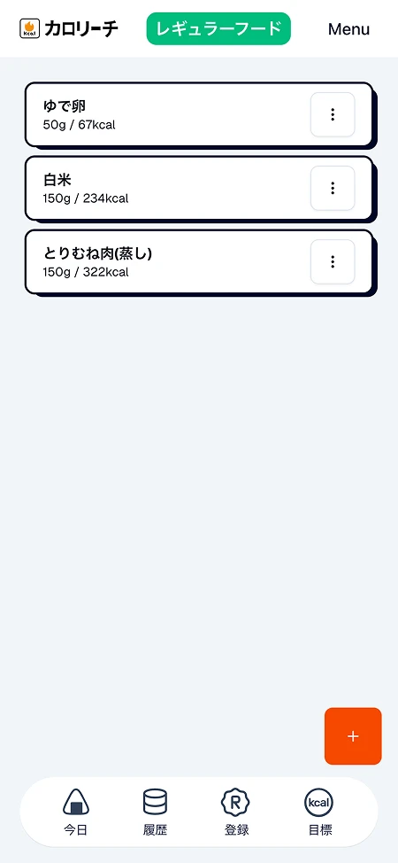 リスト管理</td>
    <td align="center">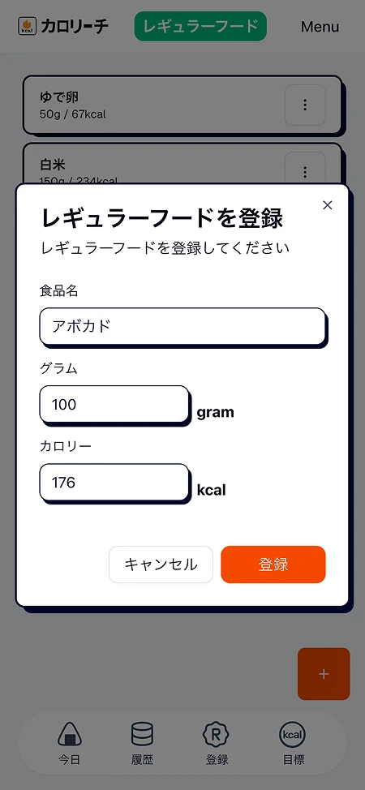 追加</td>
  </tr>
</table>
 
---

### 過去の履歴表示

日付ごとに食事履歴と合計摂取カロリーを確認・編集ができます。

<table>
  <tr>
    <td align="center">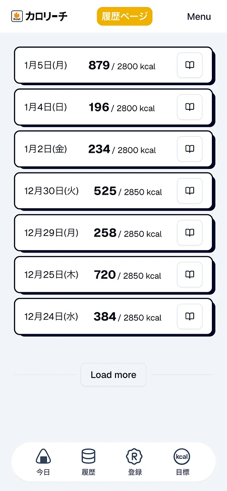 リスト管理</td>
    <td align="center">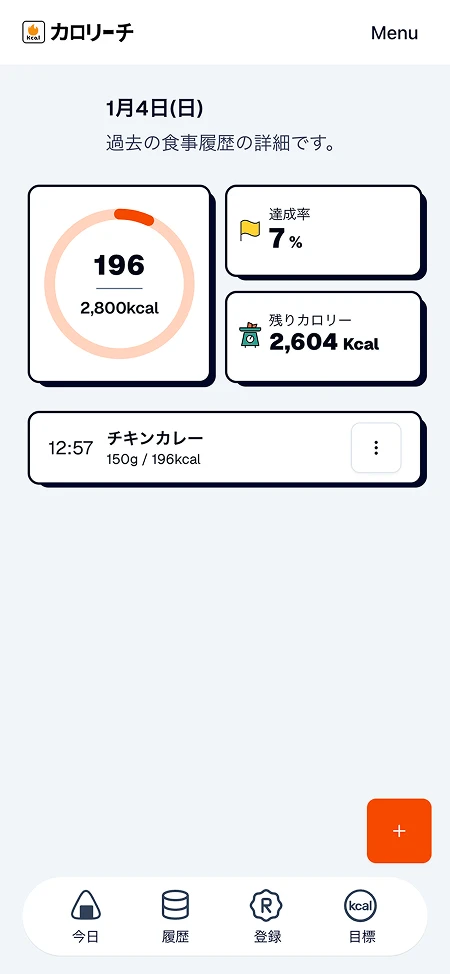 詳細ページ</td>
    <td align="center">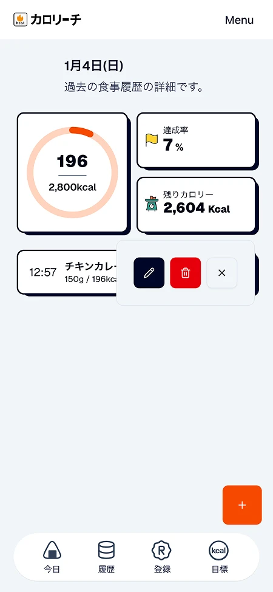 編集機能</td>
  </tr>
</table>
 
---

### 目標カロリープランニング

日付ごとに目標摂取カロリーを設定し、計画的な管理を可能にします。

<table>
  <tr>
    <td align="center">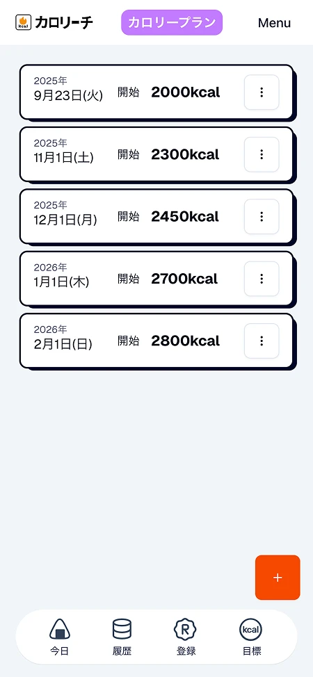 リスト管理</td>
    <td align="center">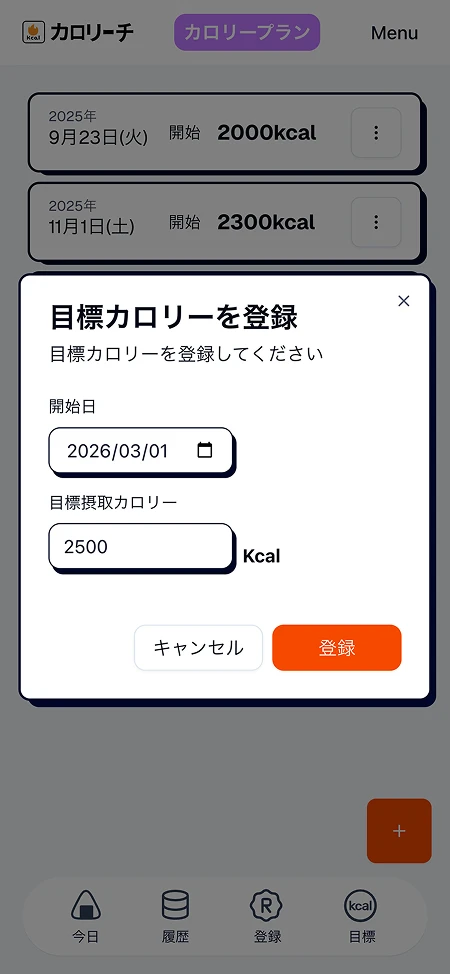 追加</td>
    <td align="center"> 編集機能</td>
  </tr>
</table>

---

### 認証機能

<table>
  <tr>
    <td align="center">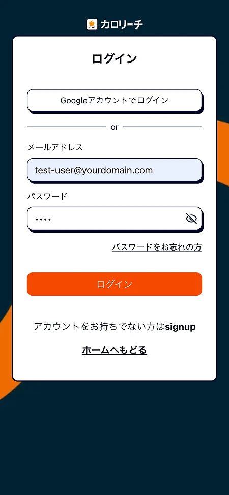 ログイン画面</td>
    <td align="center">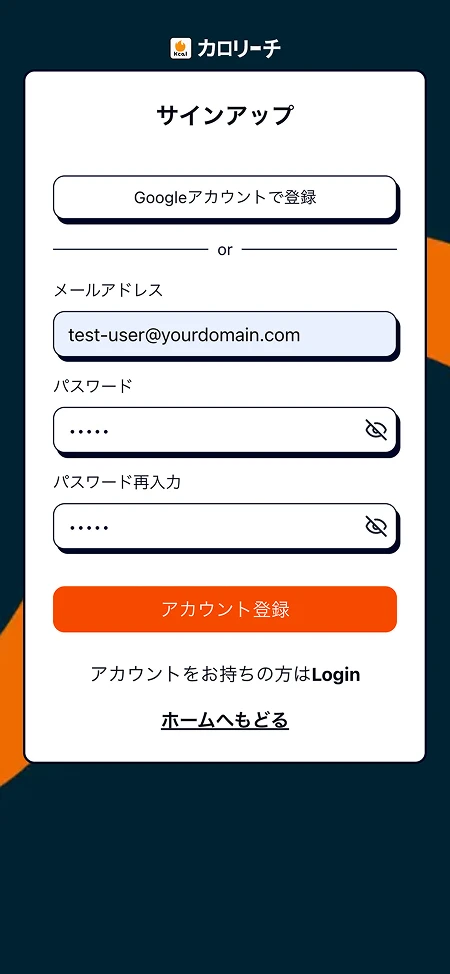 サインアップ画面</td>
  </tr>
</table>

 

---

## 使用技術

- Next.js
- TypeScript
- Drrizle
- Tailwindcss
- Lucid
- shadcn
- Storybook
- Supabase
- Vercel
- Figma

 

## Figma デザイン

[Figma design (view only)](https://www.figma.com/design/UxmVXO9warGbuWVQLxWCGX/%E3%82%AB%E3%83%AD%E3%83%AA%E3%83%BC%E3%83%81?node-id=0-1&t=PwpxJCsVcMAZJp21-1)

## ER 図

[FigJam ER(view only)](https://www.figma.com/board/3PEY8JpBJK2v25kzjU6J7U/ER%E5%9B%B3?node-id=0-1&t=35DsXmcw5ZxN6rYL-1)

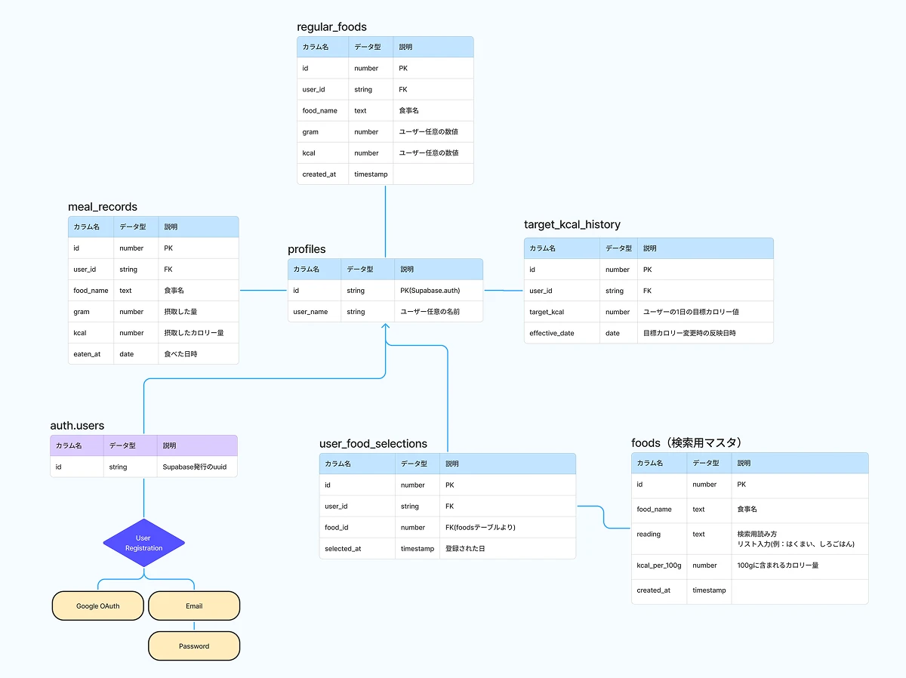
